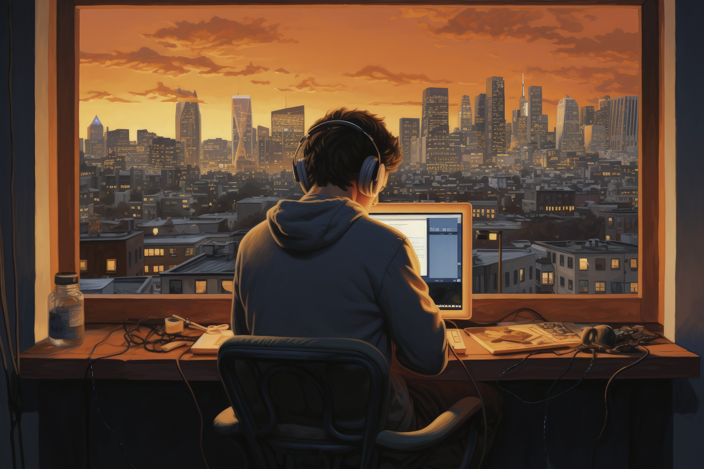

<!-- Header with catchy greeting and animated elements -->

  
# 👋 Hi, This is Asif Azad.

  
  
  <!-- Animated wave -->
  
  
  <!-- Animated typing effect - alternating between two messages -->
  

---

  

---

## 🧬 **About Me**

🌍 **Currently working remotely** as an AI Engineer at Ministry of Defence, KSA

🎓 **Fresh CS Graduate** from Bangladesh University of Engineering and Technology (BUET) - March 2025

🏀 **Sports Lover** - Active in basketball, Swimming and table tennis

🎤 **Public Speaker** - Passionate about exploring and sharing transformative ideas

📍 **Based in Dhaka, Bangladesh**

---

## 🌟 **Philosophy**

> *"Life is Beautiful"*

I believe life is a precious gift meant to be fully experienced and shared. Always open to meaningful conversations about technology, cinema, sports, or life's beautiful complexities.

---

## 💌 **Get In Touch**

**Ready for a meaningful conversation?**

*Let's discuss technology, life or anything in between!*

---

<!-- Footer wave -->

  

